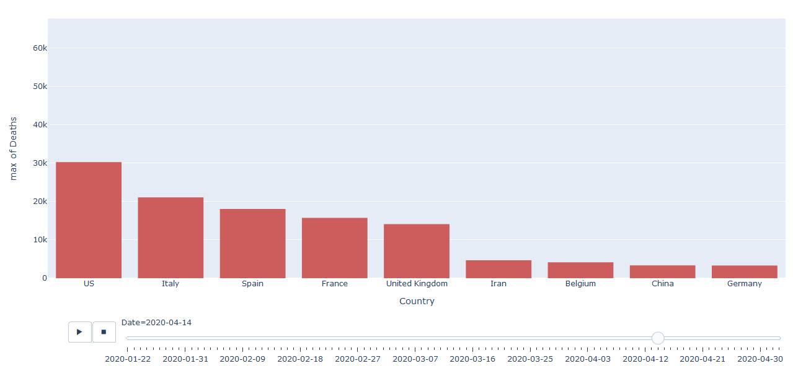
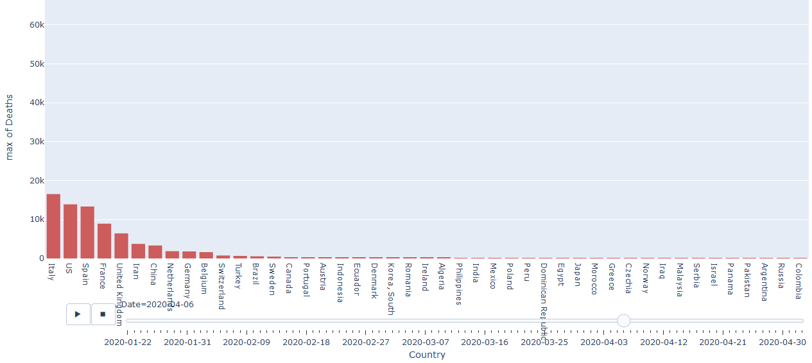
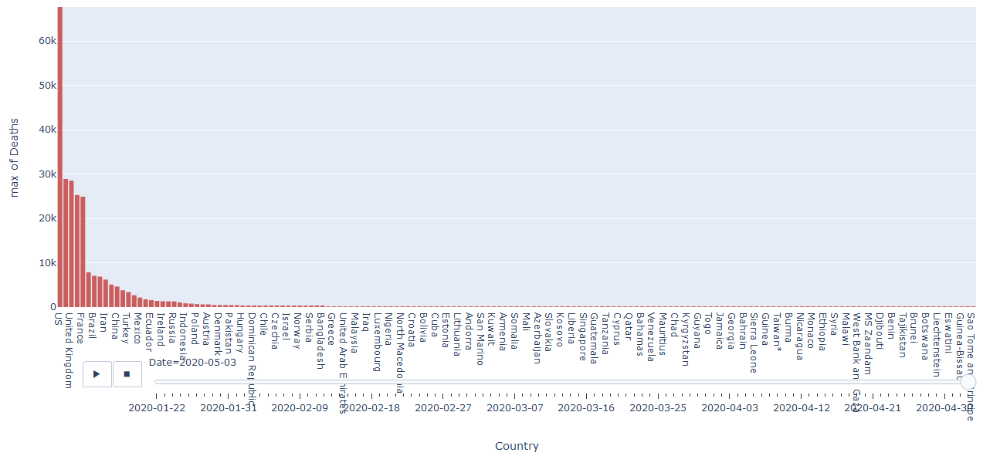

# Problem 1
The basic concept for this problem is to try developing a method can help in studying the current circumstances in a time of pandemic. 
So, we have used previously collected data for COVID-19 cases (#positively confirmed cases, # deaths and # of recovered cases through time and in the different countries), which is stored in "countries-aggregated.csv" file , and we have tried to visualize it with the required methods ,and export the resulted visualizations as vedios.
And here is an explanation for our results..........

----------------------------------
----------------------------------

**Part a**

The required was to visualize the data using animated bubble graph , where x-axis represents the number of deaths , y-axis represents the number of recovered cases and the size for each bubble is the number of positively confirmed cases in each country.
The following is a an explaining gif , and the resulted visualization is stored programmaticly by running the code in the "vedios" directory.

-----------------------------
**Part b**

The required was to visualize the data using animated color-map graph , where each country on the map is assigned a color according to the number of positively confirmed cases in that country.

----------------------------------------------------
**Part c**

At first on running the code, the graph is zoomed in on few countries, but we can click (autoscale), (reset axis) and (zoom out) to see most of the countries. Here are some instances of the bar race.

And the result wil be as shown:

-----------------------------------------------------
**Part d**

It was required to plot data and deduce information related to covid-19. In the past few weeks, the news were mostly about the spread of covid-19 in European countries: Italy, Germany, England and others. So it was said that increasing rate of deaths and confirmed cases due to the considerable number of elderly people. So here we used a dataset to show the percentage of old people in the countries from 1960 till 2018. The useful parameters in dataset: Time, Location and Value, so the percentage was plotted on the x-axis, and y-axis values here are not beneficial. We found that among the highest rates in 2018:

* **Italy (ITA):** 22.675%
* **Germany (DEU):** 21.45999%
* **France (FRA):** 19.837%

May be this contributed to the huge number of covid-19 cases. And these result are represented as shown:

---------------------------------
**Need to say that** :

- The attached GIFs are used only for explanation in the README file.
- By running each visualizing code, the resulted vedios are exported into a directory called "vedios" which is constructed programmatically , but for submitting we've attached our resulted vedios in the directory "vedios_results" .

